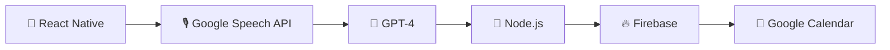

# 🎙️ Echo Talk - Your Smart Voice Assistant ✨
## Demo Video of Application:
Drive link: https://drive.google.com/file/d/1lbiOV4_NsgWz3ULWjXJ5TVEtxmdecHL6/view?usp=sharing

## 🌟 About Echo Talk

Ever wished you could fully focus on your conversation while someone else takes perfect notes? That's exactly what Echo Talk does! 🎯

> "It's like having a personal assistant in your pocket!" - Happy User 🌟

## ✨ Magic Features

### 🎤 Voice Wizardry
- 🔄 Real-time conversation recording & transcription
- 🌍 Crystal-clear English processing
- 🗣️ Multi-accent support (We speak your language!)
- 🎵 Smart noise reduction (Bye-bye, background chaos!)

### 🧠 Smart Action Detection
- ✅ Auto-magical task extraction
- 📅 Meeting schedule detection
- 💡 Key point identification
- 🎯 Decision tracking

### ⚡ Automation Powers
- 📆 Instant calendar events
- ✍️ Smart task generation
- 📝 One-click meeting summaries
- 🚀 Quick-share capabilities

### 💫 User Experience
- 📱 Beautiful mobile interface
- 👀 Watch transcription happen live
- ✏️ Edit with ease
- 🔄 Real-time processing indicators

## 🛠️ Tech Magic Stack



## 🚀 Quick Start

### 📦 Prerequisites
```bash
# Make sure you have these installed! ✨
node -v  # Should be v16+
npm -v   # Latest is greatest!
expo -V  # We're Expo powered!
```

### 🎮 Installation

1. ⭐ Clone the magic
```bash
git clone https://github.com/agrawalpallavi/echo-talk.git
cd echo-talk
```

2. 🔮 Install dependencies
```bash
npm install # Watch the magic happen!
```

3. 🎩 Configure your spells (API keys)
```bash
cp .env.example .env # Now add your magical keys!
```

4. 🚀 Launch!
```bash
npm start # Your adventure begins!
```

## 🔧 Configuration

Create your `.env` with these magical ingredients:
```env
✨ GOOGLE_CLOUD_API_KEY=your_key_here
🧠 OPENAI_API_KEY=your_key_here
🔥 FIREBASE_CONFIG=your_config_here
```

## 🤝 Join the Magic

Want to contribute? Amazing! Here's how:

1. 🍴 Fork it
2. 🌟 Create your feature branch (`git checkout -b feature/AmazingFeature`)
3. 💫 Commit your changes (`git commit -m '✨ Add some magic'`)
4. 🚀 Push to the branch (`git push origin feature/AmazingFeature`)
5. 🎉 Open a magical Pull Request

## 📜 License

This magical project is under the MIT License - spread the magic! ✨

## 📬 Stay Connected

- 📧 Email: pallavikumariagrawal8651@gmail.com

## 🌟 Wall of Fame

Special thanks to our magical contributors:
- 🧙‍♂️ Our amazing dev team
- 🔮 Our wonderful beta testers
- ⭐ Our fantastic community

---

<div align="center">

### 🌟 Star us on GitHub! 

If Echo Talk has helped you, consider giving us a star! ⭐

[](https://github.com/agrawalpallavi/echo-talk)

</div>

---

<div align="center">

Made with 💖 by Pallavi Kumari Agrawal

</div>
